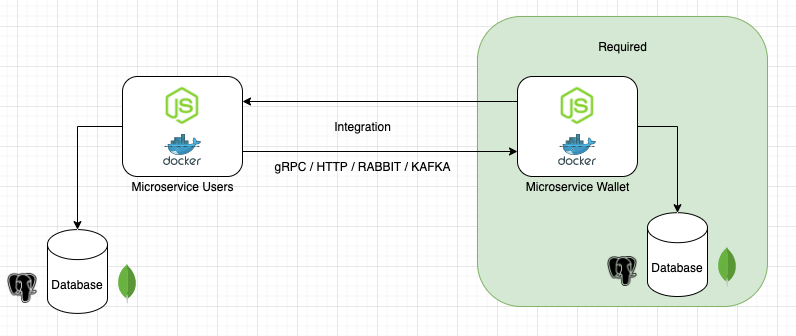

# ília - Code Challenge NodeJS
**English**
##### Before we start ⚠️
**Please create a fork from this repository**

## The Challenge:
One of the ília Digital verticals is Financial and to level your knowledge we will do a Basic Financial Application and for that we divided this Challenge in 2 Parts.

The first part is mandatory, which is to create a Wallet microservice to store the users' transactions, the second part is optional (*for Seniors, it's mandatory*) which is to create a Users Microservice with integration between the two microservices (Wallet and Users), using internal communications between them, that can be done in any of the following strategies: gRPC, REST, Kafka or via Messaging Queues and this communication must have a different security of the external application (JWT, SSL, ...), **Development in javascript (Node) is required.**

### General Instructions:
## Part 1 - Wallet Microservice

This microservice must be a digital Wallet where the user transactions will be stored 

### The Application must have

    - Project setup documentation (readme.md).
    - Application and Database running on a container (Docker, ...).
    - This Microservice must receive HTTP Request.
    - Have a dedicated database (Postgres, MySQL, Mongo, DynamoDB, ...).
    - JWT authentication on all routes (endpoints) the PrivateKey must be ILIACHALLENGE (passed by env var).
    - Configure the Microservice port to 3001. 
    - Gitflow applied with Code Review in each step, open a feature/branch, create at least one pull request and merge it with Main(master deprecated), this step is important to simulate a team work and not just a commit.

## Part 2 - Microservice Users and Wallet Integration

### The Application must have:

    - Project setup documentation (readme.md).
    - Application and Database running on a container (Docker, ...).
    - This Microservice must receive HTTP Request.   
    - Have a dedicated database(Postgres, MySQL, Mongo, DynamoDB...), you may use an Auth service like AWS Cognito.
    - JWT authentication on all routes (endpoints) the PrivateKey must be ILIACHALLENGE (passed by env var).
    - Set the Microservice port to 3002. 
    - Gitflow applied with Code Review in each step, open a feature/branch, create at least one pull request and merge it with Main(master deprecated), this step is important to simulate a teamwork and not just a commit.
    - Internal Communication Security (JWT, SSL, ...), if it is JWT the PrivateKey must be ILIACHALLENGE_INTERNAL (passed by env var).
    - Communication between Microservices using any of the following: gRPC, REST, Kafka or via Messaging Queues (update your readme with the instructions to run if using a Docker/Container environment).

## Part 3 - Frontend Implementation - Fullstack candidates only

In this challenge, you will build the frontend application for a FinTech Wallet platform, integrating with the backend microservices provided in the Node.js challenge.

The application must allow users to authenticate, view their wallet balance, list transactions, and create credit or debit operations. The goal is to evaluate your ability to design a modern, secure, and well-structured UI that consumes microservice APIs, handles authentication via JWT, and provides a solid user experience with proper loading, error, and empty states.

You may implement the solution using React, Vue, or Angular, following the required stack for the position you're running for and best practices outlined in the challenge.

### Before you start ⚠️

- **Create a separate folder for the Frontend project**
- Frontend must be built in **Typescript**.  
- The goal is to deliver a production-like UI that consumes the backend services:
  - Wallet Service (port **3001**)
  - Users Service (port **3002**, optional but mandatory for Senior)

### Challenge Overview

You will build a **web application** that allows a user to:

- Authenticate (if Users service exists)
- View wallet balance
- List transactions
- Create transactions (credit/debit)
- Handle loading, empty, and error states properly

### Design Guidelines

No visual prototype or UI mockups will be provided for this challenge on purpose. This is intentional so we can evaluate your product sense, design judgment, and ability to translate business requirements into a coherent user experience. You should focus on creating a clean, modern, and intuitive interface that prioritizes usability and clarity of financial information. Pay special attention to information hierarchy (for example, making balance visibility prominent), form usability and validation, transaction readability, and clear feedback for system states such as loading, success, and errors. Consistency in layout, spacing, typography, and component reuse is important, as well as responsiveness and accessibility basics. *We are not evaluating graphic design skills*, but rather your ability to craft a professional, production-ready UI that engineers and users would find reliable and easy to use.

Feel free to leverage on any opensource components library.

### Requirements 
This frontend should reflect real-world practices:
- secure JWT handling
- clean UX flows
- robust API integration
- scalable component structure
- test coverage where it matters
- supports i18n
- responsive design (supporting mobile browser)

#### In the end, send us your fork repo updated. As soon as you finish, please let us know.

#### We are available to answer any questions.

Happy coding! 🤓